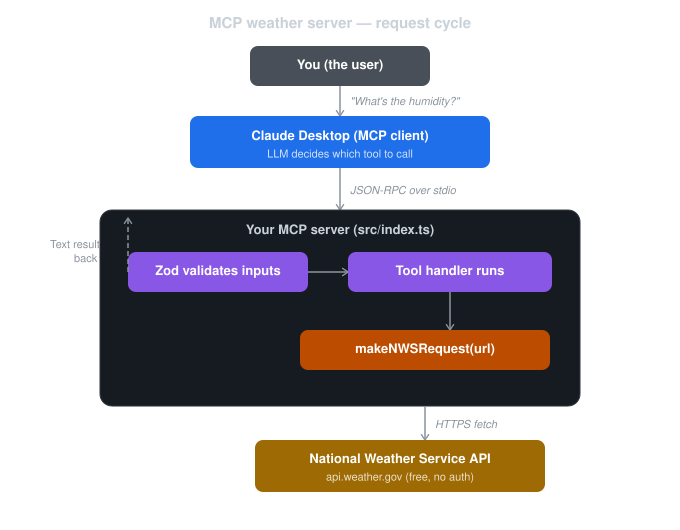

# Weather MCP Server

An MCP (Model Context Protocol) server that gives Claude Desktop access to live US weather data. Built with TypeScript and the MCP SDK.

## What it does

Three tools Claude can call:

- **get_forecast** — weather forecast for any US lat/long (temperature, wind, conditions)
- **get_alerts** — active weather alerts for any US state
- **get_conditions** — detailed conditions (humidity, precipitation chance, dewpoint, temperature)

All data comes from the [National Weather Service API](https://api.weather.gov) — free, no API key needed, US locations only.

## How it works



You ask Claude Desktop a weather question in plain English. Here's the full cycle:

1. **You ask Claude Desktop** — "What's the humidity in West Lafayette?"
2. **Claude (the LLM) decides which tool to call.** It sees `get_conditions` with its description, figures out the coordinates, and constructs a tool call.
3. **Claude Desktop (the MCP client) sends that tool call to your server.** It's a JSON-RPC message piped over stdin to the Node process. The server uses stdio transport — two processes on your machine talking through a text pipe.
4. **Your server receives the call.** Zod validates the inputs (latitude between -90 and 90, longitude between -180 and 180).
5. **First API call.** The handler hits `api.weather.gov/points/{lat},{long}` — asking the NWS which grid square this location falls in. NWS responds with a grid ID, X, and Y.
6. **Second API call.** The handler hits `api.weather.gov/gridpoints/{gridId}/{X},{Y}` — asking for the raw weather data for that grid square. NWS responds with humidity, precipitation probability, temperature, and dewpoint.
7. **The handler formats the data** into a plain text string and returns it through stdio to Claude Desktop.
8. **Claude reads the raw text** and writes a natural language answer for you.

The server never sees the user's question. Claude never sees the NWS API. Each piece does one job.

## Setup

```bash
# Clone and install
git clone https://github.com/YOUR_USERNAME/weather-mcp-server.git
cd weather-mcp-server
npm install

# Build
npm run build
```

## Connect to Claude Desktop

Add this to `~/Library/Application Support/Claude/claude_desktop_config.json`:

```json
{
  "mcpServers": {
    "weather": {
      "command": "node",
      "args": ["/ABSOLUTE/PATH/TO/weather-mcp-server/build/index.js"]
    }
  }
}
```

Restart Claude Desktop (Cmd+Q, then relaunch).

## Try it

- "What's the weather in Sacramento?"
- "Any weather alerts in Texas?"
- "What's the humidity in West Lafayette right now?"

## Built with

- [MCP SDK](https://modelcontextprotocol.io/) — Model Context Protocol for TypeScript
- [Zod](https://zod.dev/) — input validation
- [National Weather Service API](https://api.weather.gov) — free US weather data
